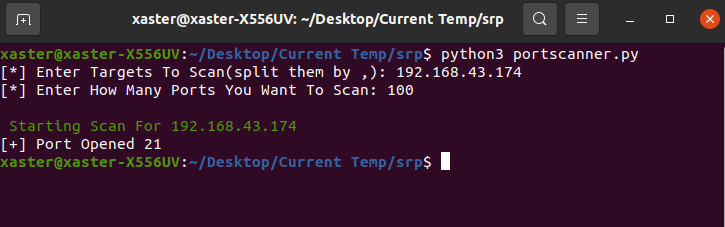

# srp

> Scan for vulnerable ports on your network



Have you ever tried deploying an app on a server before? You will realize sometimes we let some vulnerabilities while developing our app, and when its time for it to sit on the server network we often have some open port on our network which if exploited can lead to a loss or transgression of sensitive data. This simple tool helps you catch just that, your vulnerable ports.  


## ⚡ Prerequisites

- Python
  - Install using this tutorial for [windows/linux/mac](https://www.python.org/downloads/) 


## 🔧 Setting up the Project

1. Fork repository

2. Clone the forked repository in prefered directory

   ```bash
   git clone <project-url>
   ```

3. Enter project directory
  
   ```bash
   cd srp
   ```


## ⚙️ Running the project

   ```bash
   python3 portscanner.py
   ```


## 🤝 Contributing
If you will like to contribute to this project, simply follow the steps in the contribution guide or reach out to me on twitter @xasterKies if you need any direction.

